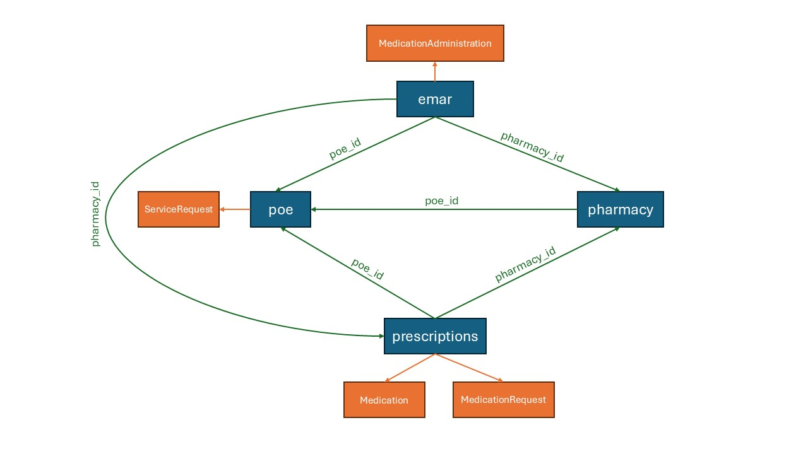

# mimic-iv-to-fhir
Mapping of MIMIC-IV data to FHIR R4 by using toFHIR (https://github.com/srdc/tofhir) engine.

This project will provide the mapping definitions and configurations for converting MIMIC-IV v2.0 data (https://mimic.mit.edu/) 
into HL7 FHIR R4 resources and storing them to a FHIR server by using the toFHIR engine(https://github.com/srdc/tofhir). 
toFHIR is an easy-to-use data mapping and high-performant data transformation tool to transform existing datasets from 
various types of sources to HL7 FHIR. It provides a simple template based mapping language to define your mappings from 
your source data format into a specific FHIR resource. You can find more information in toFHIR GitHub page. 

The followings are the brief description of the folder hierarchy.
* In the ['schemas'](./schemas) older, you can find the schemas of tables for MIMIC-IV data in terms of FHIR StructureDefinition which is 
required by toFHIR to perform a quick validation on source data. For example, ['patients.json'](./schemas/hosp/patients.json) provides the schema of 
'patients' table under 'hosp' module of MIMIC-IV.
* In the ['mappings'](./mappings) folder, you can find mapping definitions each defining a mapping from a MIMIC-IV table to a specific 
FHIR resource. For example, ['patients.json'](./mappings/hosp/patients.json) provide the mapping that will convert each row in MIMIC-IV 'patient' table 
into a FHIR Patient resource.
* In the ['mapping-jobs'](./mapping-jobs) folder, you will find a range of job configurations that will convert data in a subset or all MIMIC-IV tables and 
store them into a configured FHIR server or file system. For example, ['mimic-hosp-csv-to-fhir-server.json'](mapping-jobs/hosp/mimic-hosp-csv-to-fhir-server.json) 
will map all information in 'hosp' module given in CSV files into FHIR resources and store them a FHIR server where base 
URL can be provided with environment variable 'FHIR_REPO_URL'.
* In the ['terminology-systems](./terminology-systems) folder, you can find the CSV files that corresponds to FHIR ConceptMap or CodeSystem definitions 
used during some mapping. For example 'mimic_labitems_to_loinc.csv' includes the mapping of MIMIC-IV labitem identifiers 
to LOINC codes that is used for mapping 'labevents' into FHIR Observation resource to also convert the lab result code 
into LOINC.

The following sections describes the mappings defined until now and some assumptions as well as possibilities that you do 
with toFHIR while converting the data to FHIR.

## Mappings for Hosp module
### Mapping of ['patients'](https://mimic.mit.edu/docs/iv/modules/hosp/patients/) table into ['FHIR Patient'](http://www.hl7.org/FHIR/patient.html) resources
There is not much detail in this mapping, only we use anchor_year and anchor_age to calculate the birth year of patient 
to set birthDate element.

### Mapping of ['labevents'](https://mimic.mit.edu/docs/iv/modules/hosp/labevents/) table into ['FHIR Observation'](http://www.hl7.org/FHIR/observation.html) resources
* As you may see from the mapping definition, the mapping produces an FHIR Observation resource compliant with [US-Core Observation Lab profile](http://hl7.org/fhir/us/core/StructureDefinition/us-core-observation-lab). 
Similar to this you can update the mapping definition to produce resources that are compliant with other profiles you need.
* The 'itemid' that is the identifier indicating the lab test in MIMIC-IV data is mapped to a corresponding LOINC code. 
For this mapping, we have used the mapping [file](https://github.com/MIT-LCP/mimic-code/blob/main/mimic-iv/mapping/d_labitems_to_loinc.csv) provided in [MIMIC-Code repository](https://github.com/MIT-LCP/mimic-code).
and convert it to the toFHIR CSV representation of FHIR ConceptMap, [labitems-to-loinc.csv](terminology-systems/MIMICTerminologyService/labitems-to-loinc.csv).
Both the 'itemid' and the corresponding LOINC code (if exists) are set in Observation.code element as they may be both 
beneficial for the users. 
* As you may know, when the lab result is non-numeric, textual data is provided in MIMIC data. By using toFHIR terminology 
mapping facilities, we have shown how you can map some of these to corresponding LOINC or SNOMED-CT codes to enhance the 
semantics of your data while converting it to FHIR. The file ['labitem-coded-values-to-loinc.csv'](terminology-systems/MIMICTerminologyService/labitem-coded-values-to-loinc.csv) provides the 
ConceptMap file including some examples. For example, the values 'NEG' or 'NEGATIVE' are transformed into the LOINC 
code 'LA6577-6'. You can update the file with new mappings to map the values to your own value sets.
If the 'value' column is null (as there are many in the data), we also try to parse the 'comments' column and convert it 
to a corresponding code by writing some simple FHIR path expressions.
* Numeric lab results provided in the 'valuenum' column as well as the statements like '>1.05' provided in the 
'value' column are converted to quantified values and set to Observation.valueQuantity.
* If we cannot extract a numeric or coded value with the above methods, then value is set as valueString in Observation.
* For 'specimen_id' column indicating the identifier of the specimen, we use FHIR Logical referencing as there is no further 
table or data related with this specimen to link with.
* For 'priority' column, we use an [extension](http://hl7.org/fhir/us/cdmh/StructureDefinition/cdmh-pcornet-lab-test-priority) defined by Common Data Models Harmonization (CDMH) project.

### Mapping of ['admissions'](https://mimic.mit.edu/docs/iv/modules/hosp/admissions/) table into ['FHIR Encounter'](http://www.hl7.org/FHIR/ecnounter.html) resources
* Based on the 'admission_type', we infer the category of the encounter (Encounter.class) by using the mapping context 
map file ['admission-type-concept-map'](mapping-contexts/hosp/admission-type-concept-map.csv). Context maps are used in toFHIR 
to get a corresponding value based on a key. The first column in the file is the key and other columns are the attributes 
for that key to access within your mappings. You can use 'mpp:getConcept(...)' function to access these attributes.
* We join the 'admissions' table with 'transfers' table to get the locations of patient during whole hospital stay and
use this information to populate 'Encounter.location' element. By using another mapping we map unique care units
listed in 'transfers' table into FHIR Location recources which we give reference to within 'Encounter.location.location'.
* We also join the 'admissions' table with 'services' table to get the services patient get during the encounter. We map 
these into encounter type (Encounter.type) using the original service code in MIMIC also mapping it to a corresponding 
SNOMED-CT code ([Mapping of Service codes to SNOMED-CT](terminology-systems/MIMICTerminologyService/services-to-snomed.csv)).
* The 'admission_location' is similarly mapped to a suitable HL7 code from the [FHIR encounter-admit-source ValueSet](http://hl7.org/fhir/ValueSet/encounter-admit-source)  by using the ['admission-location-to-hl7.csv'](terminology-systems/MIMICTerminologyService/admission-location-to-hl7.csv).
Note that the concept map also includes mapping the location into a SNOMED-CT code if there is no direct mapping to one of 
the concepts in the value set to distinguish such cases (e.g. WALK-IN/SELF REFERRAL).
* The 'discharge_location' is similarly mapped to a suitable  code from the [FHIR encounter-discharge-disposition ValueSet](http://hl7.org/fhir/ValueSet/encounter-discharge-disposition)  by using the ['discharge-location-to-hl7.csv'](terminology-systems/MIMICTerminologyService/discharge-location-to-hl7.csv).
Note that the concept map also includes mapping the location into a SNOMED-CT code if there is no direct mapping to one of
the concepts in the value set to distinguish such cases (e.g. HOME HEALTH CARE).
* In order not to lose the information Emergency department admission and discharge times ('edregtime' and 'edouttime'), 
we use them in 'Encounter.location' element where the location is specified by the code indicating it is an Emergency 
department.
* The 'insurance' information is put as an extension to the resource with url 'https://mimic.mit.edu/fhir/StructureDefinition/ext-insurance'
with string value.
* Other demographic information ('race' and 'marital_status') are not directly put into Encounter resource as 
they are part of Patient resource in FHIR. toFHIR supports FHIR Patch interaction and enable users to 
map the content into FHIR Patch contents (FHIR Path Patch or JSON Patch) that are used to partially update a resource. 
We use this mechanism here and define another mapping expression within the same mapping to update FHIR Patient resources 
with this partial information.
  * The 'race' is mapped to an extension as defined in [US-Core](http://hl7.org/fhir/us/core/StructureDefinition/us-core-race) 
  where the race is mapped to a suitable code from [FHIR Race ValueSet](http://terminology.hl7.org/ValueSet/v3-Race) by 
  using the concept map ['race-to-hl7.csv'](terminology-systems/MIMICTerminologyService/race-to-hl7.csv).
  * The 'marital_status' is mapped to 'Patient.maritalStatus' element by using the concept map ['marital-status-to-hl7.csv'](terminology-systems/MIMICTerminologyService/marital-status-to-hl7.csv).
* Please note that, as there is no much information about the meaning of the concepts used for admission/discharge type, location 
we have used our best knowledge to choose the corresponding codes from the FHIR or SNOMED-CT codes. You can check and update 
the mappings according to your requirements.
* We also join the 'diagnoses_icd' and 'procedures_icd' tables into the 'admissions' table by using the 'hadm_id' column. 
Then we use the data to populate the 'Encounter.diagnosis' element with references to diagnoses and procedures applied 
during the admission.

### Mapping of ['diagnoses_icd'](https://mimic.mit.edu/docs/iv/modules/hosp/diagnoses_icd/) table into ['FHIR Condition'](http://hl7.org/fhir/condition.html) resources
* Unique identifier for a Condition resource is generated via hashing by using the 'hadm_id' and 'seq_no'.
* The ['d_icd_diagnoses'] table is also joined to the source data to get the display text for ICD codes.
* Category is indicated as 'encounter-diagnosis' for all as it is the logic for the MIMIC data.
* Given 'icd_code' is processed and converted to actual ICD-9-CM or ICD-10-CM code (with the dot) and set into 'Condition.code' element.
* ICD-9 codes are also mapped to ICD-10 codes by using the General Equivalence Mappings (GEM) file provided by CMS. The [mapping file](mapping-contexts/hosp/icd9toicd10cmgem.csv) is used as context map file in toFHIR. 
Only mappings that do not use combinations of codes (combination of ICD-10 codes for a single ICD-9 code) are performed.  

### Mapping of ['procedures_icd'](https://mimic.mit.edu/docs/iv/modules/hosp/procedures_icd/) table into ['FHIR Procedure'](http://hl7.org/fhir/procedure.html) resources
* Unique identifier for a Condition resource is generated via hashing by using the 'hadm_id' and 'seq_no'.
* The ['d_icd_procedures'] table is also joined to the source data to get the display text for ICD codes.
* For ICD-9 codes, given 'icd_code' is processed and converted to actual ICD-9-PCS code (with the dot) and set into 'Procedure.code' element.
* ICD-9 codes are also mapped to ICD-10 codes by using the General Equivalence Mappings (GEM) file provided by CMS. The [mapping file](mapping-contexts/hosp/icd9toicd10pcsgem.csv) is used as context map file in toFHIR.
Only mappings that do not use combinations of codes (combination of ICD-10 codes for a single ICD-9 code) are performed.

## Medication related tables in MIMIC-IV:

Since there are relationships in the tables related to medications in the MIMIC data set, 
the mappings were made in accordance with this in order to preserve this.
In the diagram below, you can see the relationship between the tables and which FHIR resources they map to. 
After that, there are detailed explanations for each mapping.

### Mapping of ['prescriptions'](https://mimic.mit.edu/docs/iv/modules/hosp/prescriptions/) table into ['FHIR MedicationRequest'](http://hl7.org/fhir/medicationrequest.html) and ['FHIR Medication'](http://hl7.org/fhir/medication.html) resources
In this mapping we have used FHIR Medication resources to represent the medications mentioned in MIMIC database. 
For each distinct medication (drug name + NDC code) in prescriptions table, we have created the FHIR Medication resource 
based on the information (drug, gsn, formulary_drug_cd, prod_strength, form_unit_disp) given in the table. The following items give information about this mapping.
* Unique identifier for a Medication resource is generated via hashing by using the 'drug', 'gsn', 'ndc', 'formulary_drug_cd'
* We have mapped 'ndc' and 'formulary_drug_cd' to Medication.code
* We use RxNorm API to retrieve the medication details given NDC code (corresponding RxNorm Concept id, its ingredients and their ATC codes, dose form, etc)
* By using the RxNorm API, we use the RxNorm Concept id for dose form of medication for medication form code (Medication.form)
* By using the RxNorm API, we use the corresponding ATC codes for found ingredients for medication and map the dose units 
and ingredient strengths coming from RxNorm API

For prescriptions;
* The route code given in the table is transformed to SNOMED-CT (http://hl7.org/fhir/ValueSet/route-codes)
* Dosing units are converted to UCUM or codes from http://terminology.hl7.org/CodeSystem/v3-orderableDrugForm if possible

### Mapping of ['poe'](https://mimic.mit.edu/docs/iv/modules/hosp/poe/) table into ['FHIR ServiceRequest'](http://hl7.org/fhir/servicerequest.html) resources
* The column 'order_type' is mapped to SNOMED-CT for classification of ordered service (ServiceRequest.category).
* The column 'order_subtype' is mapped SNOMED-CT for further classification of ordered service (ServiceRequest.code). 
Note that some codes cannot be mapped to a proper SNOMED-CT code.

### Mapping of ['emar'](https://mimic.mit.edu/docs/iv/modules/hosp/emar/) and ['emar_detail'](https://mimic.mit.edu/docs/iv/modules/hosp/emar_detail/) tables into ['FHIR MedicationAdministration'](http://hl7.org/fhir/medicationadministration.html) resources
In this mapping we have used FHIR MedicationAdministration resources to represent the emar table and emar_detail in MIMIC database.
First of all, we have joined the emar and emar_detail tables to get the detailed information about the medication administrations. 
For each emar entity, we get multiple entities from emar_detail table. Based on the mimic documentation, 
rows with a value in the parent_field_ordinal column indicate that the drug has been administered to the patient, 
and rows with a null value indicate the dose that should be administered. We have used this information to create 
MedicationAdministration resources for each row in emar_detail table by filtering the rows with a value in parent_field_ordinal column.
The following items give information about this mapping:
* Unique identifier for a MedicationAdministration resource is generated via hashing by using the 'emar_id', 'parent_field_ordinal'.
* We have mapped 'event.txt' to MedicationAdministration.status using a concept map file ['emar-status-to-hl7.csv'](R4/mapping-contexts/hosp/emar-status.csv).
* By using the subject_id, we have linked the MedicationAdministration to the corresponding Patient resource (MedicationAdministration.subject).
* By using the hadm_id, we have linked the MedicationAdministration to the corresponding Encounter resource (MedicationAdministration.context).
* charttime is mapped as MedicationAdministration.effectiveDateTime.
* pharmacy_id is mapped as MedicationAdministration.request if exists.
* We also have joined the emar table with the ['prescriptions'](https://mimic.mit.edu/docs/iv/modules/hosp/prescriptions/) table to get the medication details for the MedicationAdministration resources. 
We have used the 'drug', 'gsn', 'ndc' and 'formulary_drug_cd' columns in the prescriptions table 
to get the corresponding Medication resource for the MedicationAdministration. If there is no corresponding prescription,
we simply map 'medication' column in the emar table to medicationReference.display.
* 'dose_given' and 'dose_given_unit' are mapped to MedicationAdministration.dosage.dose.
* 'route' column is mapped to MedicationAdministration.dosage.route using a concept map file ['med-routes-to-snomed'](R4/mapping-contexts/hosp/med-routes-to-snomed.csv).
* 'site' column is mapped to MedicationAdministration.dosage.site as a textual value.

### Mapping of ['omr'](https://mimic.mit.edu/docs/iv/modules/hosp/omr/) table into ['FHIR Observation'](http://hl7.org/fhir/observation.html) resources
* Results are mapped to Observation resources complying the FHIR VitalSigns profiles except the eGFR. So the corresponding 
LOINC codes are used for Observation.code.
* For blood pressure measures given in different contexts (lying, standing, etc), an additional SNOMED-CT code is used to indicate the context.

### Mapping of ['microbiologyevents'](https://mimic.mit.edu/docs/iv/modules/hosp/microbiologyevents/) table into ['FHIR Specimen'](http://hl7.org/fhir/specimen.html), ['FHIR DiagnosticReport'](http://hl7.org/fhir/DiagnosticReport.html) and ['FHIR Observation'](http://hl7.org/fhir/observation.html) resources
In this mapping, we first grouped this dataset based on samples. For this, we used
subject_id, hadm_id, micro_specimen_id, spec_itemid, spec_type_desc columns. 
After grouping, we created a FHIR Specimen and FHIR DiagnosticReport for each row. 
And for each microevent_id within a group, we created a FHIR Observation resource.

For DiagnosticReport;
* A fixed code display pair ("MB", "Microbiology") is used for DiagnosticReport.category and a fixed code display pair
  ("4341000179107", "Microbiology Report") is used for DiagnosticReport.code to indicate the type of the report.
* 'subject_id' is mapped as DiagnosticReport.subject.
* 'hadm_id' is mapped as DiagnosticReport.encounter.
* 'charttime' or 'chartdate' is mapped as DiagnosticReport.effectiveDateTime.
* A reference to the Specimen is mapped as DiagnosticReport.specimen using 'micro_specimen_id' column.
* A micro specimen may have multiple 'microevent_id's. For each of these, we create an Observation reference in  
DiagnosticReport.result.

For specimen;
* Unique identifier 'micro_specimen_id' is used as Specimen.id.
* 'subject_id' is mapped as Specimen.subject.
* 'charttime' is mapped as Specimen.receivedTime.
* 'spec_itemid' is mapped as Specimen.type. We put the code itself from the dataset and also mapped it to 
the HL7 FHIR standard using ['specimen-types-to-hl7.csv'](R4/terminology-systems/MIMICTerminologyService/specimen-types-to-hl7.csv). 

For Observation;
* Unique identifier 'microevent_id' is used as Observation.id.
* Since it's microbiology data, we have used the ("MB", "Microbiology") pair from 
"http://terminology.hl7.org/CodeSystem/v2-0074" as a fixed value.
* We mapped the lab test information code in the 'test_itemid' column to Observation.code as is. 
We also mapped the lab code to LOINC using ['test-itemids-to-loinc'](R4/terminology-systems/MIMICTerminologyService/test-itemids-to-loinc.csv) 
if available and put it back in Observation.code.
* 'subject_id' is mapped as Observation.subject as a reference to the patient.
* 'hadm_id' is mapped as Observation.encounter as a reference to the encounter.
* 'charttime' or 'chartdate' is mapped as Observation.effectiveDateTime.
* 'storetime' or 'storedate' is mapped as Observation.issued.
* 'dilution_value' and 'dilution_comparison' are mapped to Observation.valueQuantity.
* 'interpretation' is mapped to Observation.interpretation using a concept map file ['test-itemids-interpretation-to-hl7'](R4/terminology-systems/MIMICTerminologyService/test-itemids-interpretation-to-hl7.csv) 
(e.g. 'S' is mapped to the 'S' code and the 'Suspectible' display).
* Textual data in 'comments' column regarding this observation are mapped to Observation.note.
* 'micro_specimen_id' is mapped as Observation.specimen as a reference to the specimen.
* There are two phases in the microbiology data: 
  * whether an organism is grown and if grown what the organism is.
  * if the organism is grown, which antibiotic is used to test the organism.

  First, we checked if the 'org_itemid' column is not null. If it is not null, we put the organism details into Observation.component.
  'org_itemid' value is translated to a SNOMED-CT code using ['org-itemids-to-snomed'](R4/terminology-systems/MIMICTerminologyService/org-itemids-to-snomed.csv).
  Second, we checked if the 'ab_itemid' column is not null. If it is not null, 
  we put which antibiotic is used into Observation.component as well.
  'ab_itemid' value (anti-biotic code) is translated to an ATC code using ['ab-itemids-to-atc'](R4/terminology-systems/MIMICTerminologyService/ab-itemids-to-atc.csv).

## How to run the ETL jobs
You can download the latest release of toFHIR from the GitHub page or download the source code and build it to get the 
toFHIR executable, an executable standalone JAR file. Copy the JAR file into this project directory.

Mapping jobs provided in the ...(to be continued)

